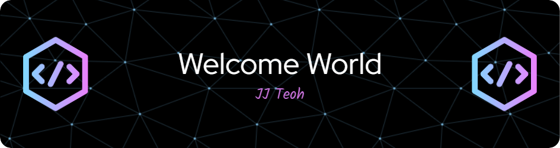

### Hello World 👋

- 😄 Software Craftsman that didnt make it to SILICON VALLEY
- 🖥️ Backend specialized, full-stack capable
- ❤️ Main stack: NodeJS, TypeScript, Clean Architecture
- 📜 Top 3 favorite quotes:
  - _First they  ignore you, then they laugh at you, then they fight you, then you win_ -- M. Ghandhi
  - _Great works are performed not by strength but by perserverance_ -- Samuel Johnson
  - _Leadership is not about being in charge, but taking care of those in your charge_ -- Simon Sinek
- My website >>> [Click Here](https://www.jjteoh.dev/)
- My old Github account >>> [Click Here](https://github.com/jjteoh-pingspace)

 

