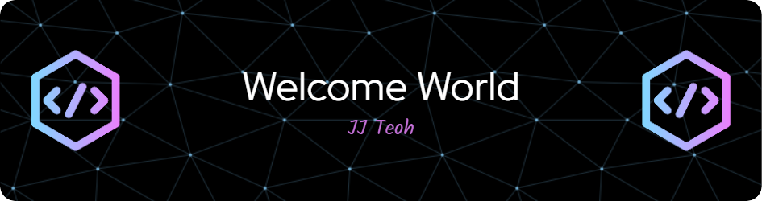

### Hello World 👋

- 😄 Software Craftsman based in Malaysia
- 🚀 AI-supercharged software engineer
- 🖥️ Backend specialized, full-stack capable
- ❤️ Main stack: NodeJS, TypeScript, Clean Architecture
- 📜 Top 3 favorite quotes:
  - _First they  ignore you, then they laugh at you, then they fight you, then you win_ -- M. Ghandhi
  - _Leadership is not about being in charge, but taking care of those in your charge_ -- Simon Sinek
  - _七転び八起き(ななころびやおき) - Fall seven times, came back up eight times_ -- Japanase Proverb
- 🌏 My website >>> [Click Here](https://www.jjteoh.dev/)
- 💡 Casually write about tech, book-review, life experience and career advise. >>> [Click Here](https://itsjjteoh.substack.com/)
- ☠️ Old Github account >>> [Click Here](https://github.com/jjteoh-pingspace)

 

